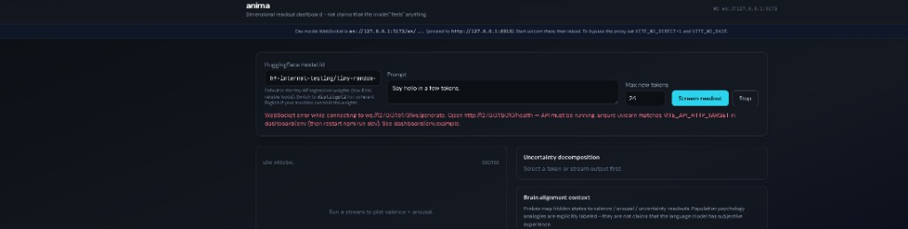

# Anima (beta)

[](LICENSE)

**Repository:** [github.com/Siddarthb07/Anima](https://github.com/Siddarthb07/Anima)

**Anima** is a research-facing stack for watching **what happens inside a Hugging Face causal LM** while it generates text. It registers **forward hooks** on a configurable set of transformer layers, grabs hidden states at each new token, and turns those tensors into **scalar readouts** (valence, arousal, probe-style uncertainty) plus extra diagnostics (entropy, attention summaries, layer-disagreement hints). A **FastAPI** server exposes REST and **WebSocket** streaming; the **React + Vite** dashboard plots readouts live so you can click tokens and inspect uncertainty and “brain-alignment” context panels.

I’m shipping this as **beta**: defaults and JSON shapes might still move. The UI wording is intentional — this is **instrumentation**, not evidence that the model **feels** emotions.

---

## What it’s actually doing (end-to-end)

1. **Load a causal LM** from Hugging Face (default is a tiny regression checkpoint so the pipeline runs on modest RAM; you can switch to `distilgpt2` or other ids supported in `core/layer_config.py`).
2. **Run generation** from your prompt. On each step, hooks capture **layer hidden states** for the current token.
3. **Linear probe heads** (`probes/linear_probe.py`) map fused activations to **valence** (−1…1), **arousal** (0…1), and a probe **uncertainty** scalar.  
   - If `probes/zoo/<model_slug>.pt` is missing, those weights are **random** — great for wiring the UI, weak for interpretive claims until you train (`probes/train.py`).
4. **Uncertainty breakdown** in the UI mixes probe output with **cheap signals** from logits and attention (see `core/extractor.py`) so you get bars for entropy, logit-gap-style spread, attention, and a fused score.
5. **TRIBEv2-style surrogate** (`alignment/tribe_encoder.py`): deterministic linear projections of the **same** hooked states into named ROI-like axes for the dashboard — a **visualization ladder**, not TRIBE fMRI decoding (details in [docs/PROJECT_OVERVIEW.md](docs/PROJECT_OVERVIEW.md)).
6. **Suppression / layer-disagreement** heuristics (`core/suppression.py`) can flag tokens where early vs late layers disagree — surfaced after the stream completes.

So in one sentence: **Anima streams token-by-token geometric summaries of internal activations**, not a chatbot with opinions.

---

## What the dashboard looks like

After `npm run dev` + API on **:8010**, you get a dark UI with model id, prompt, max tokens, **Stream readout**, a **valence × arousal** circumplex, uncertainty decomposition, brain-alignment / TRIBEv2 surrogate panels, concatenated decoded text, and a per-token strip.

**Example run** (default tiny model — decoded text is gibberish by design; readouts still exercise the full path):


*Figure: live readout while streaming. The tiny HF test model repeats subwords like `fe` — that’s expected noise, not a broken install. Swap to `distilgpt2` when you want readable English.*

---

## Quick try

```powershell
pip install -e ".[dev]"
cd dashboard && npm install && copy .env.example .env
```

Terminal A: `python -m uvicorn api.server:app --host 127.0.0.1 --port 8010`  
Terminal B (from `dashboard/`): `npm run dev` → open **http://127.0.0.1:5173**

Windows helper (after installs):  
`powershell -ExecutionPolicy Bypass -File scripts\start_anima.ps1`

Full detail: [docs/GETTING_STARTED.md](docs/GETTING_STARTED.md).

---

## If the UI shows a WebSocket error

The dashboard expects the API at the URL in `dashboard/.env` (`VITE_API_HTTP_TARGET`, default `http://127.0.0.1:8010`). In dev, traffic usually goes through the Vite proxy — **start uvicorn first**, then **`npm run dev`**, and reload the page.



*Figure: typical error when uvicorn isn’t running or the port/env doesn’t match — open `/health` on the API host and align `.env`.*

---

## Documentation

| Doc | What’s in it |
|-----|----------------|
| [**Getting started**](docs/GETTING_STARTED.md) | Install, ports, models, REST/WebSocket, Docker, troubleshooting |
| [**Project overview**](docs/PROJECT_OVERVIEW.md) | Repo layout, probe zoo vs random weights, TRIBE surrogate clarification |
| [**Usage & limitations**](docs/USAGE_AND_LIMITATIONS.md) | What you should and shouldn’t use this for |
| [**Docs index**](docs/README.md) | Links to everything above |
| [**Commands & tests**](docs/RUN_AND_TEST_COMMANDS.txt) | Pytest, CLI, optional Playwright demo |

Contributing: [`CONTRIBUTING.md`](CONTRIBUTING.md) · Security: [`SECURITY.md`](SECURITY.md)

---

## License

Released under the [MIT License](LICENSE). Model weights from Hugging Face remain under **their** licenses — Anima only runs models you point it at.
