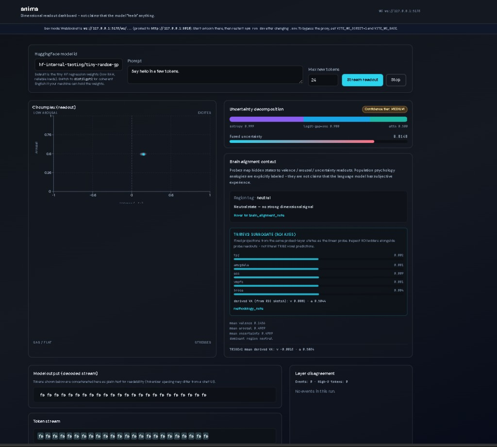

# Anima

[](LICENSE)

**Open-source instrumentation** for Hugging Face **causal language models**: per-token hidden-state hooks → valence / arousal / uncertainty readouts, optional brain-alignment training, and a live dashboard.

Anima is **not** a chat product and **does not integrate with Ollama**. Point it at a [supported Hugging Face model id](core/layer_config.py) (e.g. `distilgpt2`, `mistralai/Mistral-7B-Instruct-v0.2`) and load or train matching probe weights under `probes/zoo/`.

---

## Who this is for

- Researchers and developers who want **measurable internal readouts** while a model generates text.
- Anyone reproducing or extending **probe training** (GoEmotions text path, Narratives-style fMRI path).
- Contributors — MIT licensed, standard Python + FastAPI + optional Vite UI.

**Not for:** claiming models “feel” emotions, clinical use, or running weights inside Ollama without the HF stack.

---

## Quick start (any OS)

```bash
git clone https://github.com/Siddarthb07/Anima.git
cd Anima
python scripts/bootstrap.py
```

This installs the package, builds the minimal brain-training dataset, trains default **tiny** probes (low RAM), and runs tests.

**Run:**

```bash
anima api --port 8010
# other terminal:
cd dashboard && cp .env.example .env && npm install && npm run dev
```

Open **http://127.0.0.1:5173** (API health: **http://127.0.0.1:8010/health**).

Windows: `powershell -ExecutionPolicy Bypass -File scripts\start_anima.ps1` after bootstrap.

---

## Models & probes

| Question | Answer |
|----------|--------|
| Does it work with Ollama? | **No.** Use the equivalent **Hugging Face** model id. See [docs/MODELS_AND_ZOO.md](docs/MODELS_AND_ZOO.md). |
| Are Mistral/Llama probes pre-trained? | **CPU tier:** [Release v1.1.0](https://github.com/Siddarthb07/Anima/releases/tag/v1.1.0) (tiny + distilgpt2). **1B+ proxies / 7B:** CI [train-zoo workflow](.github/workflows/train-zoo.yml) or train locally. |
| Default model | `hf-internal-testing/tiny-random-gpt2` — CPU-friendly; LM output is intentionally noisy. |
| Bigger models | Need RAM/GPU + `huggingface-cli login` for gated weights. [docs/TRAIN_ON_YOUR_MACHINE.md](docs/TRAIN_ON_YOUR_MACHINE.md) |

### Published probe weights (CPU tier)

**Download pre-trained checkpoints** (no training required):

```bash
python scripts/download_zoo.py              # from GitHub Release v1.1.0
python scripts/download_zoo.py --list       # show asset URLs
```

Or train locally: checkpoints are **gitignored** (`*.pt`); **metrics sidecars** (`*.meta.json`) are in git.

```bash
python scripts/download_narratives_minimal.py
python scripts/train_all_probes.py          # tiny + minimal Narratives brain probe
anima train-text --model distilgpt2 --max-samples 500
anima train --model distilgpt2 --narratives-root ./data/narratives_minimal
```

| HF model | Release assets | Origin |
|----------|----------------|--------|
| `hf-internal-testing/tiny-random-gpt2` | `tiny_random_gpt2_text.pt`, `tiny_random_gpt2_narratives_pca.pt`, `tiny_random_gpt2_tribe_proj.npz` | `text_emotion` + `narratives_fMRI_synthetic_minimal` |
| `distilgpt2` | `distilgpt2_text.pt`, `distilgpt2_narratives_pca.pt`, `distilgpt2_tribe_proj.npz` | same (live benchmark 2026-05-24) |

More families (Qwen, TinyLlama, SmolLM2, 7B): [GitHub Actions train-zoo workflow](.github/workflows/train-zoo.yml) → download artifact into `probes/zoo/`.

### Train remaining zoo families

```bash
anima train-zoo --tier cpu                    # TinyLlama, Qwen-0.5B, SmolLM2 proxies (~8 GB+ RAM)
ANIMA_TRAIN_LARGE=1 anima train-zoo --tier large   # Llama-3-8B, Mistral-7B, Qwen2-7B, Gemma-9B (GPU)
```

Per-model overrides: `anima train-text --model <hf_id>` and `anima train --model <hf_id> --narratives-root <path>`. Ollama name → HF id: [`scripts/ollama_to_hf.json`](scripts/ollama_to_hf.json). CI builds large tiers: [`.github/workflows/train-zoo.yml`](.github/workflows/train-zoo.yml) (download workflow artifacts into `probes/zoo/`).

---

## Benchmarks (v1)

Run locally: `anima benchmark --model <hf_id> --tiers internal,external,external_text,external_guard`  
Manifests: [`benchmarks/reports/latest_manifest.json`](benchmarks/reports/latest_manifest.json) (tiny), [`benchmarks/reports/latest_distilgpt2_manifest.json`](benchmarks/reports/latest_distilgpt2_manifest.json).

**Data notes:** Narratives numbers use the **synthetic minimal** corpus in `data/narratives_minimal/` (story holdout `lucy`), not full ds002345. GoEmotions text benchmark uses the **validation** split (≤200 samples). Guard fixtures are **4-sample** smoke sets (`benchmarks/fixtures/`). Brain-Score skipped unless installed (`SKIP_BRAINSCORE=1` by default).

### `hf-internal-testing/tiny-random-gpt2` — run 2026-05-18

| Benchmark | Metric | Value |
|-----------|--------|-------|
| Narratives holdout | Val MSE | 0.118 |
| | Pearson r (valence / arousal) | −0.109 / −0.239 |
| | Word-rate baseline r (holdout lucy) | 0.097 |
| GoEmotions (text probe, val split) | Pearson r (valence / arousal) | 0.004 / 0.010 |
| HaluEval guard fixture | Abstain accuracy / AUROC | 1.00 / 1.00 |
| TruthfulQA guard fixture | Abstain accuracy / AUROC | 1.00 / 1.00 |
| TRIBE reference | — | skipped (no `tribev2`) |
| Brain-Score Language | — | skipped |

### `distilgpt2` — live run 2026-05-24

| Benchmark | Metric | Value |
|-----------|--------|-------|
| Narratives holdout | Val MSE | 0.081 |
| | Pearson r (valence / arousal) | 0.284 / 0.004 |
| | Word-rate baseline r (holdout lucy) | 0.097 |
| GoEmotions (text probe, val split) | Pearson r (valence / arousal) | 0.057 / 0.021 |
| HaluEval guard fixture | Abstain accuracy / AUROC | 1.00 / 1.00 |
| TruthfulQA guard fixture | Abstain accuracy / AUROC | 1.00 / 1.00 |

Manifest: [`benchmarks/reports/latest_distilgpt2_manifest.json`](benchmarks/reports/latest_distilgpt2_manifest.json). Reproduce: `anima benchmark --model distilgpt2 --tiers internal,external,external_text,external_guard`.

---

## What it does

1. Load a causal LM from Hugging Face and register **forward hooks** on selected layers.
2. On each generated token, map activations through **trainable probe heads** (valence, arousal, uncertainty).
3. Expose **REST** + **WebSocket** streaming; optional **React dashboard** for live plots.
4. Optional **Narratives-shaped** brain alignment training (`probes/train.py`) and guard / benchmark tooling.

If `probes/zoo/<model_slug>*.pt` is missing, probes are **random** — fine for plumbing, not for scientific claims until you train.



---

## CLI

```bash
anima api --port 8010
anima train-zoo --tier cpu
ANIMA_TRAIN_LARGE=1 anima train-zoo --tier large
anima benchmark --model distilgpt2 --tiers internal,external,external_text,external_guard
```

Ollama → HF: `scripts/ollama_to_hf.json` · Full list: `anima --help` · [docs/BENCHMARKS.md](docs/BENCHMARKS.md) · [docs/TRAINING.md](docs/TRAINING.md)

---

## Documentation

| Doc | Contents |
|-----|----------|
| [Getting started](docs/GETTING_STARTED.md) | Install, Docker, API, dashboard |
| [Models & zoo](docs/MODELS_AND_ZOO.md) | HF vs Ollama, checkpoint naming |
| [Training](docs/TRAINING.md) | Text + brain probes |
| [Benchmarks](docs/BENCHMARKS.md) | Manifests and external suites |
| [Build plan](docs/BUILD_PLAN.md) | Phased roadmap (local vs CI vs release) |
| [Project overview](docs/PROJECT_OVERVIEW.md) | Architecture |
| [Usage & limitations](docs/USAGE_AND_LIMITATIONS.md) | Ethics and scope |
| [Contributing](CONTRIBUTING.md) | PRs, tests, conduct |

---

## Development

```bash
python -m pytest -q -k "not distilgpt2"
RUN_HF_TESTS=1 python -m pytest -q   # optional Hub downloads
```

CI: `.github/workflows/ci.yml`

---

## License

[MIT](LICENSE). Hugging Face **model weights** stay under their own licenses; you are responsible for compliance when you download or redistribute them.
