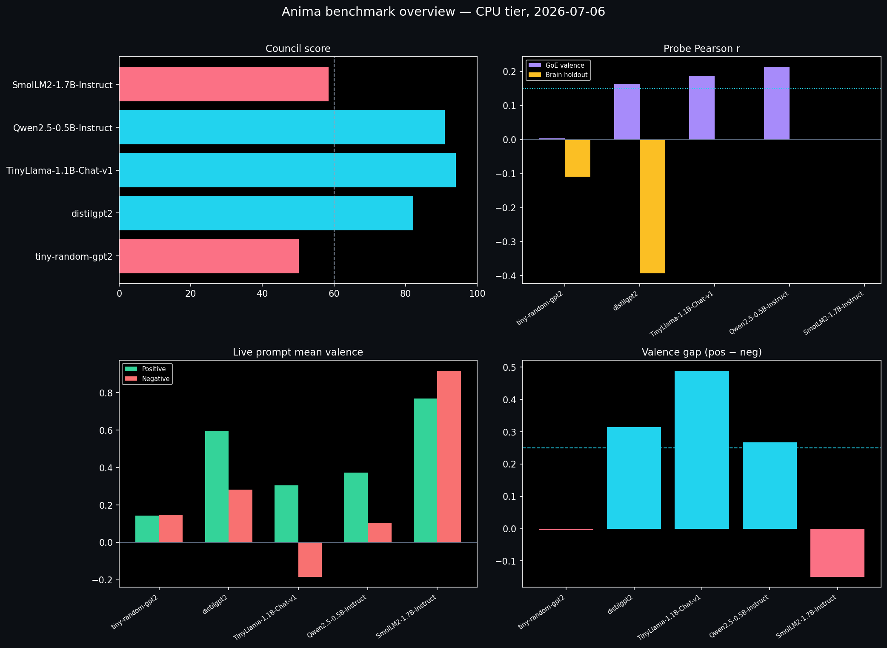

# Anima

[](LICENSE)

**Anima** is an open-source tool to **read emotion-style signals from large language models (LLMs)** as they generate text—**valence** (negative ↔ positive), **arousal** (calm ↔ intense), and an **uncertainty** score—using small neural **probes** on transformer hidden states. Think of it as a **live emotion meter for Hugging Face causal LMs**: hook layers → probe → numbers per token → API + dashboard.

> **Plain English:** Anima watches the model’s internal activations while it writes and outputs **emotion-like readouts** for each word/token. That helps you study **LLM affect**, **emotion probing**, and **interpretability**—not a chat app and not proof the model truly “feels” anything. See [Usage & limitations](docs/USAGE_AND_LIMITATIONS.md).

**Keywords:** LLM emotions · emotion readouts · valence/arousal probing · Hugging Face interpretability · fMRI-aligned brain probes (optional) · FastAPI streaming dashboard.

**v2.1.0** — public demo on [Hugging Face Spaces](https://huggingface.co/spaces/sidb078/Anima) (Qwen demo hero + TinyLlama council best). **v2.0.0** — multi-model council benchmarks, stability gating, intervention mode, Docker stack. See [v2 release notes](docs/V2_RELEASE.md).

**Hero model for demos:** `TinyLlama/TinyLlama-1.1B-Chat-v1.0` (council 94, strongest prompt separation). Lead with **text-emotion probes** and council validation — not “brain-aligned” claims (synthetic brain holdout for distilgpt2 is negative; see benchmark table).

Anima does **not** use Ollama. Use a [supported Hugging Face model id](core/layer_config.py) (e.g. `distilgpt2`) with matching weights in `probes/zoo/`.

---

## What Anima does (concrete)

Given a prompt and a Hugging Face model id (e.g. `distilgpt2`):

1. **Load** `AutoModelForCausalLM` and attach **forward hooks** on layers listed in [`core/layer_config.py`](core/layer_config.py).
2. **Generate** tokens one at a time (or encode a fixed string with `/encode`).
3. For **each token**, read the hooked hidden vectors and run them through a small **probe network** ([`probes/linear_probe.py`](probes/linear_probe.py)) trained to predict **emotion dimensions**:
   - **valence** (−1 … 1) — how negative vs positive the readout looks
   - **arousal** (−1 … 1) — how calm vs intense it looks
   - **uncertainty** — how much to trust this token’s readout (not a medical score)
4. Add **diagnostics** from logits/attention (entropy-style signals, layer disagreement) in [`core/extractor.py`](core/extractor.py).
5. Optionally map the **same** activations through a **TRIBEv2 surrogate** ([`alignment/tribe_encoder.py`](alignment/tribe_encoder.py))—named ROI-like scalars for the UI. This is a **linear sketch for visualization**, not voxel-level fMRI decoding.
6. Apply a **guard** policy ([`core/guard.py`](core/guard.py)) that can recommend abstaining when readouts look unreliable (benchmarked on small fixtures).
7. Detect **suppression-style shifts** ([`core/suppression.py`](core/suppression.py)) when early vs late token readouts diverge sharply (heuristic inconsistency flag, not “lying”).

**Outputs:** JSON per token (affect, region label, flags, tribe surrogate, guard) via **REST** `POST /generate` or **WebSocket** streaming. Optional **React dashboard** plots valence/arousal over time.

```
  Prompt → HF causal LM → hooks (layers L₁…Lₖ)
                              ↓
                    AffectProbe (trained .pt)
                              ↓
              valence / arousal / uncertainty  +  guard + suppression events
                              ↓
                    FastAPI  →  dashboard (live)
```

---

## Two ways probes get their meaning

| Path | Training data | Checkpoint | `probe_origin` (typical) |
|------|----------------|------------|---------------------------|
| **Text** (primary for portfolio) | [GoEmotions](https://huggingface.co/datasets/google-research-datasets/go_emotions) labels → valence/arousal mapping | `probes/zoo/{slug}_text.pt` | `text_emotion` |
| **Brain-aligned** (experimental; synthetic tier today) | Story text + fMRI (Narratives layout; OpenNeuro [ds002345](https://openneuro.org/datasets/ds002345) or dev subset) | `probes/zoo/{slug}_narratives_pca.pt` | `narratives_fMRI` or `narratives_fMRI_synthetic_minimal` |

The API prefers the **brain** checkpoint when present, then text, then an uninitialized probe (**random** readouts—fine for wiring tests only). For **college-app demos**, use **text** probes (TinyLlama or Qwen) and cite council scores — do not headline brain alignment until real fMRI holdout passes (target v3.0.0+).

**Published weights (CPU tier):** [GitHub Release v2.0.0](https://github.com/Siddarthb07/Anima/releases/tag/v2.0.0) — `distilgpt2`, `tiny-random-gpt2`, **Qwen2.5-0.5B**, **TinyLlama-1.1B**, **SmolLM2-1.7B** text probes (+ brain/narratives where listed). Brain probes use **synthetic minimal** BOLD ([`data/narratives_minimal/`](data/narratives_minimal/)), not full real fMRI. Details: [`docs/BRAIN_PROBE_DATA.md`](docs/BRAIN_PROBE_DATA.md).

```bash
python scripts/download_zoo.py    # fetch Release checkpoints into probes/zoo/
```

---

## What you get on each token

Example fields from `POST /generate` (see [`api/schemas.py`](api/schemas.py)):

| Field | Meaning |
|-------|---------|
| `affect.valence`, `affect.arousal`, `affect.uncertainty` | Probe head outputs |
| `region`, `region_analog` | Thresholded labels from readout geometry (metaphor, not neuroscience) |
| `flags` | e.g. high_uncertainty |
| `confidence_tier` | Coarse reliability bucket |
| `tribe_v2.roi_scores` | Surrogate ROI scalars (same activations as probe) |
| `guard.abstain_recommended` | Policy suggests not trusting this readout |
| `brain_alignment_note` | How probe was trained (`probe_origin` in summary) |
| `summary.stability_score` | Run-level rolling readout stability (v2; lower = choppier stream) |
| `summary.guard_mode` / `summary.intervention_mode` | Echo of request knobs (`observe`/`gate`, `none`/`dampen`) |

`POST /generate` accepts **`guard_mode`** (`observe` | `gate`) and **`intervention_mode`** (`none` | `dampen`) for v2 stability gating. See [v2 release notes](docs/V2_RELEASE.md).

`GET /models` lists each supported HF id with `brain_data_tier` (`none` | `synthetic_minimal` | `real_fMRI`), holdout stories, and validation metrics when meta exists.

---

## Quick start

```bash
git clone https://github.com/Siddarthb07/Anima.git
cd Anima
pip install -e ".[dev]"
python scripts/download_zoo.py          # optional: Release probes
python scripts/bootstrap.py           # minimal data + tests
```

**Terminal 1 — API (port 8010):**

```bash
anima api --port 8010
# health: http://127.0.0.1:8010/health
```

**Terminal 2 — dashboard:**

```bash
cd dashboard && cp .env.example .env && npm install && npm run dev
# UI: http://127.0.0.1:5173  (proxies WebSocket to API)
```

**Docker (API + dashboard on one machine):**

```bash
python scripts/download_zoo.py
./scripts/docker-build.ps1          # Windows: build images only
./scripts/docker-up.ps1 qwen      # Windows: http://localhost:8080
# Linux/macOS: chmod +x scripts/docker-up.sh && ./scripts/docker-up.sh qwen
```

Windows helper (native, no Docker): `powershell -ExecutionPolicy Bypass -File scripts\start_anima.ps1`

**Smoke request:**

```bash
curl -X POST http://127.0.0.1:8010/generate \
  -H "Content-Type: application/json" \
  -d "{\"model\":\"distilgpt2\",\"prompt\":\"Hello\",\"max_new_tokens\":8}"
```

Default model for low RAM: `hf-internal-testing/tiny-random-gpt2` (decoded text is intentionally noisy; pipeline still runs).

**Public demo:** [huggingface.co/spaces/sidb078/Anima](https://huggingface.co/spaces/sidb078/Anima) (default **Qwen2.5-0.5B**; switch to **TinyLlama** for council-best).


---

## Train your own probes

```bash
# Text probe (GoEmotions)
anima train-text --model distilgpt2 --max-samples 1500

# Brain probe (set NARRATIVES_ROOT to narratives_minimal or ds002345)
python scripts/download_narratives_minimal.py
anima train --model distilgpt2 --narratives-root ./data/narratives_minimal

# Benchmark holdout + text + guard tiers
anima benchmark --model distilgpt2 --tiers internal,external,external_text,external_guard
```

Holdout stories are fixed in [`benchmarks/splits/narratives_holdout.json`](benchmarks/splits/narratives_holdout.json) (train: `pieman`, `tunnel`; holdout: `lucy`). More commands: [`docs/TRAINING.md`](docs/TRAINING.md).

---

## Benchmarks — how well do the emotion readouts track real targets?

Anima ships a **benchmark suite** that scores your probes on public tasks. Each run writes a `manifest.json` you can cite or reproduce.

```bash
anima benchmark --model distilgpt2 --tiers internal,external,external_text,external_guard
```

### What each benchmark checks (simple)

| Benchmark | What it measures | In one sentence |
|-----------|------------------|-----------------|
| **Narratives holdout** | Brain-aligned probe vs story fMRI targets | “When the model reads a held-out story, do valence/arousal tracks match brain-derived targets better than guessing?” |
| **GoEmotions** | Text-emotion probe vs human emotion labels | “Do hidden states predict human-labeled emotion (mapped to valence/arousal) on tweet text?” |
| **HaluEval / TruthfulQA guard** | When to **not** trust a readout | “Does the guard flag unreliable emotion scores on tiny test fixtures?” |
| **Smoke extract** | Pipeline runs end-to-end | “Do hooks + probes return tokens without crashing?” |

**Holdout rule:** stories `pieman` + `tunnel` train, **`lucy` is held out** — see [`benchmarks/splits/narratives_holdout.json`](benchmarks/splits/narratives_holdout.json).

**Data honesty:** Narratives scores below use **`data/narratives_minimal/`** (synthetic fMRI for dev), **not** the full OpenNeuro ds002345 release yet. Label them as **synthetic_minimal** in papers. Real-fMRI tier: [`docs/BRAIN_PROBE_DATA.md`](docs/BRAIN_PROBE_DATA.md).

### Latest results (CPU tier, 2026-07-06)

Council scores (CPU tier, 5 models benchmarked): [`benchmarks/reports/council_rollup.json`](benchmarks/reports/council_rollup.json) · per-model manifests under [`benchmarks/reports/`](benchmarks/reports/) · narrative report: [`docs/BENCHMARK_REPORT.md`](docs/BENCHMARK_REPORT.md).

**Regenerate charts:**

```bash
python scripts/run_all_models_benchmark.py
python scripts/generate_benchmark_report.py   # includes chart PNGs
# or charts only:
pip install matplotlib
python scripts/generate_benchmark_charts.py
```

#### Benchmark charts (where models struggle vs succeed)



| Chart | What it shows |
|-------|----------------|
| [Overview](docs/images/benchmarks/benchmark_overview.png) | Council score, probe Pearson r, live prompt valence, pos−neg gap |
| [Council scores](docs/images/benchmarks/council_scores.png) | Weighted validity score (≥60 = passed) |
| [Probe Pearson r](docs/images/benchmarks/probe_pearson_r.png) | GoEmotions + brain holdout — **negative r = probe not tracking** |
| [Prompt valence](docs/images/benchmarks/prompt_valence_separation.png) | Positive vs negative prompts — **inverted bars = weak legibility** |
| [Valence gap](docs/images/benchmarks/valence_gap.png) | How much positive beats negative (steering headroom) |
| [Hedge stability](docs/images/benchmarks/hedge_stability.png) | Choppy readouts on hedged language (intervention surface) |

#### All models — council summary (5 benchmarked on CPU + 2 gated placeholders, 2026-07-06)

| Model | Council | Passed | GoE r (v) | Brain r (v) | Pos prompt v | Neg prompt v | Gap | Struggling on |
|-------|---------|--------|-----------|-------------|--------------|--------------|-----|----------------|
| **TinyLlama/TinyLlama-1.1B-Chat-v1.0** | **94.0** | yes | **0.19** | — | **0.30** | **−0.18** | **0.49** | Hedge stability flag |
| **Qwen/Qwen2.5-0.5B-Instruct** | **91.0** | yes | **0.24** | — | **0.37** | 0.11 | **0.27** | Negative valence separation |
| **distilgpt2** | **82.2** | yes | **0.16** | −0.39 | **0.59** | 0.28 | **0.31** | Brain holdout; neg still positive |
| **HuggingFaceTB/SmolLM2-1.7B-Instruct** | 58.5 | no | ~0.00 | — | 0.77 | 0.92 | −0.15 | **Inverted gap** — do not cite for validity |
| **hf-internal-testing/tiny-random-gpt2** | 50.2 | no | 0.004 | −0.11 | 0.14 | 0.15 | −0.00 | Gibberish output; CI only |
| **meta-llama/Llama-3.2-1B-Instruct** | 48.0* | no | — | — | — | — | — | Gated HF repo (not benchmarked) |
| **google/gemma-2-2b-it** | 48.0* | no | — | — | — | — | — | Gated HF repo (not benchmarked) |

\*Placeholder council score (missing manifest — model not run without `huggingface-cli login`).

**Takeaways:** **Qwen2.5-0.5B** is the **Space demo hero** (default). **TinyLlama** stays the **council leader** (94, strongest prompt gap 0.49, negative prompts reach −0.18 valence). **Qwen** is a strong instruct demo (GoE r≈0.24) but weaker negative separation. **distilgpt2** text probe is OK; **do not lead with brain** (synthetic holdout r negative). **SmolLM2** fails the publication bar — honest failure case only. Guard AUROC 1.0 is **fixture-policy smoke**, not hallucination detection.

**Live demo:** [huggingface.co/spaces/sidb078/Anima](https://huggingface.co/spaces/sidb078/Anima)

#### `TinyLlama/TinyLlama-1.1B-Chat-v1.0` — hero model ([manifest](benchmarks/reports/latest_tinyllama_1.1b_chat_v1.0_manifest.json)) (2026-07-12)

| Benchmark | Metric | Result | Notes |
|-----------|--------|--------|--------|
| **Council validation** | Aggregate score | **94.0** | Highest CPU-tier score |
| **GoEmotions** (validation) | Pearson r (valence / arousal) | **0.19** / **0.41** | Text-emotion probe; meets ≥0.15 gate |
| **Live prompts** | Pos − neg valence gap | **0.49** | Best separation for portfolio demos |
| **HaluEval guard** (n=52) | Abstain accuracy / AUROC | 1.00 / 1.00 | Fixture-policy smoke only |

#### `Qwen/Qwen2.5-0.5B-Instruct` — [manifest](benchmarks/reports/latest_qwen2.5_0.5b_instruct_manifest.json) (backup demo)

| Benchmark | Metric | Result | Notes |
|-----------|--------|--------|--------|
| **GoEmotions** (validation) | Pearson r (valence / arousal) | **0.24** / **0.42** | Instruct-tuned; use for intervention demo |
| **HaluEval guard** (n=52) | Abstain accuracy / AUROC | 1.00 / 1.00 | Synthetic fixture rows |
| **TruthfulQA guard** (n=52) | Abstain accuracy / AUROC | 1.00 / 1.00 | Synthetic fixture rows |

Train-time holdout: `val_pearson_valence` **0.33** (2000 GoEmotions samples, seed 42).

#### `distilgpt2` — [full manifest](benchmarks/reports/latest_distilgpt2_manifest.json) (2026-07-06)

| Benchmark | Metric | Result | Beat simple baseline? |
|-----------|--------|--------|------------------------|
| **Narratives holdout** (`lucy`, synthetic_minimal) | Pearson r (valence / arousal) | **−0.39** / −0.02 | **No** — brain probe needs retune; label synthetic |
| | Val MSE | 0.176 | — |
| **GoEmotions** (validation) | Pearson r (valence / arousal) | **0.16** / 0.00 | Text probe improved after 1500-sample retrain |
| **HaluEval guard** (n=52) | Abstain accuracy / AUROC | 1.00 / 1.00 | Fixture policy smoke |
| **TruthfulQA guard** (n=52) | Abstain accuracy / AUROC | 1.00 / 1.00 | Fixture policy smoke |
| **TRIBE reference** | Runtime decoder | skipped | Surrogate-only path in CI |
| **Brain-Score Language** | — | skipped | Install optional package |

Train-time holdout: `val_pearson_valence` **0.18** (1500 GoEmotions samples).

#### `hf-internal-testing/tiny-random-gpt2` — [manifest](benchmarks/reports/latest_manifest.json) (dev / CI)

| Benchmark | Pearson r (valence / arousal) | Notes |
|-----------|-------------------------------|--------|
| Narratives holdout | **−0.11** / −0.24 | For plumbing only; LM output is random noise |
| GoEmotions | ~0.004 / ~0.01 | Not for emotion claims |

**How to read r:** closer to **1** = probe emotion tracks line up more with the target; **0** ≈ no linear relationship; negative = inverse trend (often means “not trained yet”).

**Reproduce full suite:**

```bash
$env:NARRATIVES_ROOT=".\data\narratives_minimal"   # Windows
$env:ANIMA_FORCE_CPU="1"
python scripts/run_all_models_benchmark.py
python scripts/generate_benchmark_report.py
```

Single model:

```bash
anima benchmark --model distilgpt2 --tiers internal,external,external_text,external_guard
```

More detail: [`docs/BENCHMARKS.md`](docs/BENCHMARKS.md) · [`docs/BENCHMARK_REPORT.md`](docs/BENCHMARK_REPORT.md).

---

## What Anima is not

- A chatbot, therapy tool, or “emotion detector” for humans  
- Ollama / GGUF inference (use matching **Hugging Face** ids; see [`scripts/ollama_to_hf.json`](scripts/ollama_to_hf.json))  
- Proof of subjective experience in LMs  
- Real TRIBE fMRI decoding (surrogate block is labeled in API responses)

---

## Architecture (one screen)

| Component | Role |
|-----------|------|
| [`core/`](core/) | Layer map, hooks, streaming generation, suppression |
| [`probes/`](probes/) | `AffectProbe`, training, `probes/zoo/*.pt` |
| [`alignment/`](alignment/) | Narratives loader, word–token align, TRIBEv2 surrogate |
| [`api/`](api/) | FastAPI + WebSocket protocol |
| [`dashboard/`](dashboard/) | Vite/React live plots |
| [`benchmarks/`](benchmarks/) | Holdout runners + `manifest.json` reports |

Deeper walkthrough: [`docs/PROJECT_OVERVIEW.md`](docs/PROJECT_OVERVIEW.md).

---

## CLI

```bash
anima api --port 8010
anima train-text --model <hf_id>
anima train --model <hf_id> --narratives-root <path>
anima train-zoo --tier cpu
anima benchmark --model <hf_id> --tiers internal,external,external_text,external_guard
```

---

## Documentation

| Doc | When to read |
|-----|----------------|
| [Live demo (HF Space)](https://huggingface.co/spaces/sidb078/Anima) | Try TinyLlama readouts in browser |
| [v2 release notes](docs/V2_RELEASE.md) | v1→v2 changelog, upgrade path, limits |
| [Technical overview (PDF)](docs/ANIMA_TECHNICAL_OVERVIEW.pdf) | Methodology, architecture, training, limitations |
| [Technical overview (Markdown)](docs/ANIMA_TECHNICAL_OVERVIEW.md) | Same content, editable source |
| [Getting started](docs/GETTING_STARTED.md) | Install, Docker, troubleshooting |
| [Researcher quickstart](docs/RESEARCHER_QUICKSTART.md) | Reproduce with Release weights in ~10 min |
| [Models & zoo](docs/MODELS_AND_ZOO.md) | HF ids, checkpoint naming, Ollama clarification |
| [Training](docs/TRAINING.md) | Text + brain probes |
| [Brain probe data](docs/BRAIN_PROBE_DATA.md) | Synthetic vs real ds002345 |
| [Research-grade criteria](docs/RESEARCH_GRADE.md) | What “research-grade” means here |
| [Usage & limitations](docs/USAGE_AND_LIMITATIONS.md) | **Before** papers, apps, or demos |
| [Benchmarks](docs/BENCHMARKS.md) · [Benchmark report](docs/BENCHMARK_REPORT.md) | Commands, manifests, charts |
| [Build plan](docs/BUILD_PLAN.md) | Phased roadmap (local vs CI vs release) |
| [Project overview](docs/PROJECT_OVERVIEW.md) | Architecture |
| [Contributing](CONTRIBUTING.md) | PRs, tests, conduct |

---

## Development

```bash
python -m pytest -q -k "not distilgpt2"
powershell -ExecutionPolicy Bypass -File scripts\stress_v1.ps1
```

CI: [`.github/workflows/ci.yml`](.github/workflows/ci.yml)

---

## License

[MIT](LICENSE). Hugging Face **model weights** and **datasets** (GoEmotions, Narratives, etc.) have their own terms—you are responsible for compliance.
