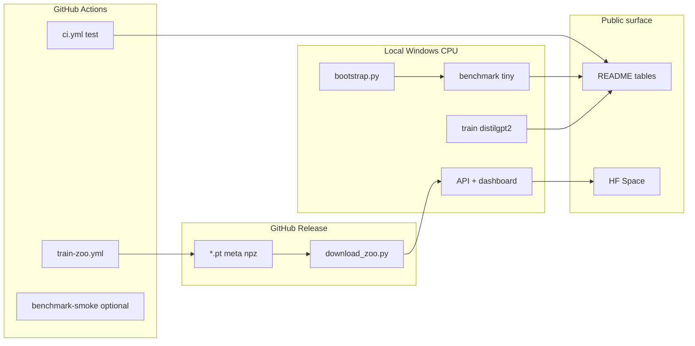

# Anima build plan

Phased plan from **v1 (shipped)** → **v1.1 (credible benchmarks + zoo release)** → **v1.2 (adoption surface)**.

Constraints: primary dev on **Windows CPU, 16 GB RAM**, Python 3.9 (see [TRAIN_ON_YOUR_MACHINE.md](TRAIN_ON_YOUR_MACHINE.md)). **7B+ training** still on GitHub Actions or GPU cloud.

---

## Current baseline (done)

| Area | Status |
|------|--------|
| Core hooks + probes + guard | Shipped |
| API `/encode`, `/models`, WebSocket | Shipped |
| Dashboard + model card | Shipped |
| Benchmark runners + manifests | Shipped (synthetic Narratives minimal) |
| CI `test` job | Green on push |
| README benchmark tables | Published (tiny live + distilgpt2 meta) |
| Local probes | `tiny_*`, `distilgpt2_*` (`.pt` gitignored) |
| Zoo release download | **Not wired** (`scripts/download_zoo.py` empty) |
| HF Space / Gradio public demo | Script exists, not deployed |
| Real ds002345 Narratives | Not integrated |
| 7B zoo weights | CI workflow exists; artifacts not on Release |

---

## Architecture of the build



---

## Phase 0 — Stabilize local dev (Week 1)

**Goal:** Reliable daily loop on your laptop without OOM.

| # | Task | Where | Command / action |
|---|------|-------|------------------|
| 0.1 | Increase Windows virtual memory (8–24 GB) | OS | Reboot after change |
| 0.2 | Fresh bootstrap | Local | `python scripts/bootstrap.py` |
| 0.3 | Fast test gate | Local | `python -m pytest -q -k "not distilgpt2"` |
| 0.4 | Benchmark env | Local | `python scripts/setup_benchmarks.py` |
| 0.5 | Tiny full benchmark | Local | `anima benchmark --model hf-internal-testing/tiny-random-gpt2 --tiers internal,external,external_text,external_guard` |
| 0.6 | Commit manifests | Git | `benchmarks/reports/latest_manifest.json` |

**Done when:** pytest passes; tiny benchmark manifest updated; API + dashboard run on tiny.

**RAM:** ~2–4 GB peak.

---

## Phase 1 — Credible CPU-tier weights (Week 1–2)

**Goal:** One **real** LM family (distilgpt2) with trained probes and live benchmark numbers in README.

| # | Task | Where | Command / action |
|---|------|-------|------------------|
| 1.1 | Retrain text probe | Local | `anima train-text --model distilgpt2 --max-samples 500` |
| 1.2 | Retrain brain probe (minimal) | Local | `anima train --model distilgpt2 --narratives-root ./data/narratives_minimal` |
| 1.3 | Live distilgpt2 benchmark | Local | `anima benchmark --model distilgpt2 --tiers internal,external,external_text,external_guard` |
| 1.4 | Fallback if OOM | Local | `python -m benchmarks.export_meta_manifest --model distilgpt2` |
| 1.5 | Update README tables | Git | Copy metrics from manifests; note synthetic Narratives |
| 1.6 | Demo on distilgpt2 | Local | `anima api --port 8010` with distilgpt2 + zoo weights present |

**Done when:** `distilgpt2_text.pt` + `distilgpt2_narratives_pca.pt` exist locally; README cites **live** or **meta-export** distilgpt2 run with date.

**RAM:** ~4–8 GB peak (comfortable on **16 GB** with paging file set).

---

## Phase 1b — CPU zoo proxies locally (Week 2, 16 GB)

**Goal:** Train **one open proxy per family** without waiting on CI.

| # | Task | Command |
|---|------|---------|
| 1b.1 | Qwen 0.5B text | `anima train-text --model Qwen/Qwen2.5-0.5B-Instruct --max-samples 200` |
| 1b.2 | TinyLlama text | `anima train-text --model TinyLlama/TinyLlama-1.1B-Chat-v1.0 --max-samples 200` |
| 1b.3 | SmolLM2 (optional) | `anima train-text --model HuggingFaceTB/SmolLM2-1.7B-Instruct --max-samples 100` |
| 1b.4 | Benchmark each | `anima benchmark --model <hf_id> --tiers external_text,external_guard` |

Run **one model per session**; reboot between if memory feels tight. Phase 2 CI still recommended for **brain** probes on 1B+ models.

---

## Phase 2 — CI zoo + Release (Week 2–3)

**Goal:** Ship probe weights others can download without training.

| # | Task | Where | Command / action |
|---|------|-------|------------------|
| 2.1 | Add `HF_TOKEN` secret | GitHub | Settings → Secrets → for gated Llama/Gemma jobs |
| 2.2 | Run `train-zoo.yml` manually | Actions | Workflow dispatch → `train-cpu` job |
| 2.3 | Download artifact `zoo-cpu-tier` | Local | Unzip into `probes/zoo/` |
| 2.4 | Optional GPU matrix | Actions | `train-gpu` for 7B (needs GPU runner + token) |
| 2.5 | Create GitHub Release `v1.1.0` | GitHub | Attach `.pt`, `.meta.json`, `.npz` (not in git) |
| 2.6 | Wire `RELEASE_ASSETS` | Code | `scripts/download_zoo.py` URLs → release assets |
| 2.7 | Document download | Docs | README “Published probe weights” → `python scripts/download_zoo.py` |

**Done when:** `download_zoo.py` fetches at least tiny + distilgpt2 + one proxy (e.g. Qwen-0.5B) from Release; bootstrap mentions release path.

**Local RAM:** 0 for training (CI only). Local load of 0.5B–1.7B may still OOM — document “inference on GPU cloud optional.”

---

## Phase 3 — Benchmark hardening (Week 3–4)

**Goal:** Numbers that survive scrutiny; fewer “skipped” tiers.

| # | Task | Where | Notes |
|---|------|-------|-------|
| 3.1 | Expand guard fixtures | Code | Grow HaluEval/TruthfulQA samples beyond n=4 smoke |
| 3.2 | GoEmotions val split | Local/CI | Full `--max-samples` on text probe; report val r |
| 3.3 | Multi-story holdout | Code | Extend `benchmarks/splits/narratives_holdout.json` |
| 3.4 | CI benchmark-smoke on push | `.github/workflows/ci.yml` | Run `internal` tier every push (fast) |
| 3.5 | Brain-Score optional job | CI | Separate workflow, Python 3.11, `SKIP_BRAINSCORE=0` |
| 3.6 | Manifest versioning | Code | Add `manifest_schema_version` field |

**Done when:** README lists guard n>50 or fixture path; GoEmotions uses validation split in table; CI uploads manifest artifact.

**Honesty rule:** Keep labeling **synthetic minimal** Narratives until real ds002345 is wired (Phase 5).

---

## Phase 4 — Adoption surface (Week 4–5)

**Goal:** One-link demo for portfolio / interviews.

| # | Task | Where | Notes |
|---|------|-------|-------|
| 4.1 | HF Space (Gradio) | Hugging Face | `scripts/gradio_demo.py`; default **tiny** or **distilgpt2** |
| 4.2 | Space README | HF | Link to Anima repo + limitations doc |
| 4.3 | Dashboard polish | Code | Model selector + probe suffix in UI |
| 4.4 | API model card | Code | `/models` returns train date, probe_origin, benchmark snapshot id |
| 4.5 | Screen capture | Assets | `docs/images/` dashboard clip for README |

**Done when:** Public Space URL in README; 2-min demo script in GETTING_STARTED.

---

## Phase 5 — Research tier (optional, Month 2+)

**Goal:** Real brain alignment path — only if you have storage + GPU time.

| # | Task | Where | Notes |
|---|------|-------|-------|
| 5.1 | Download ds002345 subset | Cloud / lab | `scripts/download_narratives.py`; 100GB+ |
| 5.2 | Train on real holdout stories | GPU | `anima train --narratives-root <ds002345>` |
| 5.3 | Re-benchmark Narratives holdout | GPU | Compare to word-rate baselines in manifest |
| 5.4 | TRIBE runtime | Optional | `pip install anima[tribe]` when tribev2 available |
| 5.5 | Paper / blog | External | Use “readout” language per USAGE_AND_LIMITATIONS |

**Not required for v1.1 portfolio release.**

---

## What runs where (quick reference)

| Work | Local Windows CPU | GitHub Actions | GPU cloud |
|------|-------------------|----------------|-----------|
| pytest (no distilgpt2) | Yes | Yes | — |
| tiny train + benchmark | Yes | Yes | — |
| distilgpt2 train + benchmark | **Yes** (16 GB + page file) | Yes | Yes |
| Qwen-0.5B / TinyLlama text train | **Yes** (one at a time, 16 GB) | Yes (`train-cpu`) | Yes |
| SmolLM2-1.7B | **Try** (low `--max-samples`) | Yes (`train-cpu`) | Yes |
| Llama-3-8B / Mistral-7B | No | Yes (`train-gpu` + HF_TOKEN) | Yes |
| Full ds002345 | No | No (artifact size) | Yes |
| HF Space hosting | No | — | HF infra |

---

## Milestones & tags

| Tag | Scope | Exit criteria |
|-----|-------|---------------|
| **v1.0.0** | Core OSS | Done (API, dashboard, benchmarks, CI) |
| **v1.1.0** | Credible CPU zoo | Release assets + download_zoo + updated README benchmarks |
| **v1.2.0** | Adoption | HF Space + CI benchmark artifact on push |
| **v2.0.0** | Research | Real Narratives holdout numbers + optional TRIBE runtime compare |

---

## Risk register

| Risk | Mitigation |
|------|------------|
| Windows 1455 on distilgpt2+ | Virtual memory; close apps; use CI artifacts |
| OneDrive sync locks files | Pause sync on repo folder during train |
| Overclaiming in README | Label synthetic data, probe_origin, n samples |
| Gated HF models fail in CI | `HF_TOKEN` + accept licenses on hub |
| Large `.pt` in git | Release only; keep `*.pt` gitignored |
| Guard AUROC 1.0 on n=4 | Phase 3 larger fixtures before citing AUROC |

---

## Weekly checklist (copy-paste)

**Week 1:** Phase 0 + start Phase 1  
**Week 2:** Finish Phase 1 + Phase 2 Release  
**Week 3:** Phase 3 CI benchmarks  
**Week 4:** Phase 4 Space + README link  
**Week 5+:** Phase 5 only if pursuing research narrative  

---

## Commands cheat sheet

```powershell
# Phase 0
python scripts/bootstrap.py
python -m pytest -q -k "not distilgpt2"
$env:SKIP_BRAINSCORE="1"
anima benchmark --model hf-internal-testing/tiny-random-gpt2 --tiers internal,external,external_text,external_guard

# Phase 1
anima train-text --model distilgpt2 --max-samples 500
anima train --model distilgpt2 --narratives-root .\data\narratives_minimal
anima benchmark --model distilgpt2 --tiers internal,external,external_text,external_guard

# Phase 2
# GitHub: Actions → Train probe zoo → download artifact → Release v1.1.0
python scripts/download_zoo.py

# Phase 4
python scripts/gradio_demo.py
anima api --port 8010
```

See also: [TRAINING.md](TRAINING.md), [BENCHMARKS.md](BENCHMARKS.md), [MODELS_AND_ZOO.md](MODELS_AND_ZOO.md).
