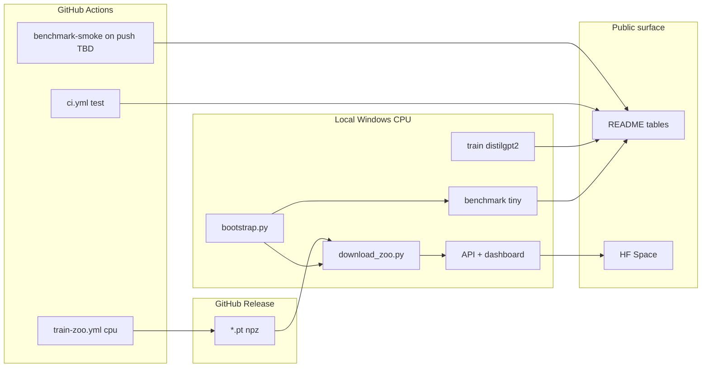

# Anima build plan

Phased plan from **v1 (shipped)** → **v1.1 (CPU zoo release)** → **v1.2 (adoption surface)** → **v2.0 (real brain, optional)**.

Constraints: primary dev on **Windows CPU, 16 GB RAM**, Python 3.9+ (see [TRAIN_ON_YOUR_MACHINE.md](TRAIN_ON_YOUR_MACHINE.md)). CI and Brain-Score jobs use **Python 3.11**. **7B+ training** requires a GPU runner or GPU cloud — not `ubuntu-latest` CPU alone.

**Version map (single source of truth):** tag meanings must match [RESEARCH_GRADE.md](RESEARCH_GRADE.md).

| Tag | Meaning |
|-----|---------|
| **v1.1.0** | CPU zoo release (tiny + distilgpt2), synthetic brain tier |
| **v1.2.0** | Adoption — HF Space, CI benchmark smoke on push, dashboard/API polish |
| **v2.0.0** | Research — real ds002345 holdout numbers + optional TRIBE compare |

---

## Current baseline

| Area | Status |
|------|--------|
| Core hooks + probes + guard | **Done** |
| API `/encode`, `/models`, WebSocket | **Done** |
| Dashboard + model card | **Done** (model selector still TODO — Phase 4) |
| Benchmark runners + manifests | **Done** (`manifest_schema_version: 1`) |
| CI `test` job | **Done** (green on push) |
| README benchmark tables | **Done** (tiny live + distilgpt2; guard n=4 — do not cite AUROC yet) |
| GitHub Release **v1.1.0** | **Done** (tiny + distilgpt2 `.pt` / `.npz`) |
| `download_zoo.py` + bootstrap integration | **Done** (`bootstrap.py` calls `--skip-existing`) |
| distilgpt2 probe **quality** | **Weak** — retrain needed (Phase 1); meta shows low/negative val r at 200 samples |
| CPU proxy weights on Release | **Not done** — Qwen/TinyLlama local-only unless v1.1.1 patch |
| CI `benchmark-smoke` on push | **Not done** — dispatch/schedule only (Phase 3) |
| HF Space / Gradio public demo | Script exists; Space not deployed (Phase 4) |
| Real ds002345 Narratives | Not integrated (Phase 5 / v2.0) |
| 7B zoo weights | `train-gpu` workflow exists but **blocked** — needs GPU runner label |

---

## Architecture of the build



---

## Phase 0 — Stabilize local dev (Week 1)

**Goal:** Reliable daily loop on your laptop without OOM.

| # | Task | Where | Command / action |
|---|------|-------|------------------|
| 0.1 | Increase Windows virtual memory (16–32 GB) | OS | Reboot after change |
| 0.2 | Fetch Release weights (optional) | Local | `python scripts/download_zoo.py --skip-existing` |
| 0.3 | Fresh bootstrap | Local | `python scripts/bootstrap.py` (calls download_zoo, then local train fallback) |
| 0.4 | Fast test gate | Local | `python -m pytest -q -k "not distilgpt2"` |
| 0.5 | Benchmark env | Local | `python scripts/setup_benchmarks.py` |
| 0.6 | Tiny full benchmark | Local | `$env:SKIP_BRAINSCORE="1"; anima benchmark --model hf-internal-testing/tiny-random-gpt2 --tiers internal,external,external_text,external_guard` |
| 0.7 | Commit manifest aliases | Git | Commit `benchmarks/reports/latest_manifest.json` and `latest_<slug>_manifest.json` only — not every timestamped run folder; use repo-relative paths |

**Done when:** pytest passes; `latest_manifest.json` updated; API + dashboard run on tiny.

**RAM:** ~2–4 GB peak.

---

## Phase 1 — Credible CPU-tier weights (Week 1–2)

**Goal:** distilgpt2 probes and benchmarks strong enough to cite in README and demos.

| # | Task | Where | Command / action |
|---|------|-------|------------------|
| 1.1 | Retrain text probe | Local | `anima train-text --model distilgpt2 --max-samples 1500` |
| 1.2 | Retrain brain probe (minimal) | Local | `anima train --model distilgpt2 --narratives-root ./data/narratives_minimal` |
| 1.3 | Live distilgpt2 benchmark | Local | `$env:SKIP_BRAINSCORE="1"; anima benchmark --model distilgpt2 --tiers internal,external,external_text,external_guard` |
| 1.4 | Fallback if OOM | Local | `python -m benchmarks.export_meta_manifest --model distilgpt2` |
| 1.5 | Update README tables | Git | Copy from `latest_distilgpt2_manifest.json`; label synthetic Narratives; show `n_samples` for guard |
| 1.6 | Demo on distilgpt2 | Local | `python scripts/download_zoo.py --skip-existing` then `anima api --port 8010` |

**Quality gates (required before Phase 1 done):**

- `distilgpt2_text.meta.json`: `val_pearson_valence` ≥ **0.10** (train-time holdout slice)
- `latest_distilgpt2_manifest.json` GoEmotions entry: validation-split `pearson_valence` reported (benchmark already uses HF `validation` split)
- Do **not** cite guard AUROC until Phase 3.1 (n>50)

**Done when:** gates pass; README cites **live** distilgpt2 manifest with date.

**RAM:** ~4–8 GB peak (comfortable on **16 GB** with paging file set).

---

## Phase 1b — CPU zoo proxies locally (Week 2, optional)

**Goal:** Train open proxies on 16 GB CPU without waiting on CI — weights stay **local** unless you attach them to a Release (v1.1.1+).

| # | Task | Command |
|---|------|---------|
| 1b.1 | Qwen 0.5B text | `anima train-text --model Qwen/Qwen2.5-0.5B-Instruct --max-samples 200` |
| 1b.2 | TinyLlama text | `anima train-text --model TinyLlama/TinyLlama-1.1B-Chat-v1.0 --max-samples 200` |
| 1b.3 | SmolLM2 (optional) | `anima train-text --model HuggingFaceTB/SmolLM2-1.7B-Instruct --max-samples 100` |
| 1b.4 | Benchmark each | `anima benchmark --model <hf_id> --tiers external_text,external_guard` |

Run **one model per session**; reboot between if memory feels tight. For shared Release artifacts, prefer CI `train-zoo.yml` → `train-cpu` (text + brain on synthetic Narratives).

To ship proxies on Release: extend `scripts/download_zoo.py` asset list + tag **v1.1.1** (or fold into next minor).

---

## Phase 2 — CI zoo + Release

**Goal:** Ship probe weights others can download without training.

| # | Task | Status | Notes |
|---|------|--------|-------|
| 2.1 | Add `HF_TOKEN` secret | Open | For gated Llama/Gemma when GPU infra exists |
| 2.2 | Run `train-zoo.yml` → `train-cpu` | **Done** (manual) | Workflow dispatch |
| 2.3 | GitHub Release **v1.1.0** | **Done** | tiny + distilgpt2 assets live |
| 2.4 | `download_zoo.py` | **Done** | Fetches v1.1.0 URLs; bootstrap uses it |
| 2.5 | README + bootstrap docs | **Done** | “Published probe weights” section |
| 2.6 | Proxy weights on Release | **Not done** | Optional v1.1.1 |
| 2.7 | `train-gpu` (7B matrix) | **Blocked** | Requires `runs-on` GPU runner — `ubuntu-latest` has no CUDA |
| 2.8 | Release automation checklist | Open | Document `gh release upload` after CI artifact download |

**v1.1.0 exit criteria:** met (tiny + distilgpt2 downloadable).

**Remaining for zoo completeness:** proxy Release (2.6), GPU tier (2.7 when infra exists).

---

## Phase 3 — Benchmark hardening (Week 3–4)

**Goal:** Numbers that survive scrutiny; fewer “skipped” tiers.

| # | Task | Where | Notes |
|---|------|-------|-------|
| 3.1 | Expand guard fixtures | Code | Grow HaluEval/TruthfulQA beyond n=4 before citing AUROC |
| 3.2 | GoEmotions reporting | Local/CI | Benchmark already uses HF `validation` split; ensure README shows validation `pearson_*` after Phase 1 retrain |
| 3.3 | Multi-story holdout | Code | Extend `benchmarks/splits/narratives_holdout.json` |
| 3.4 | CI benchmark-smoke on push | `.github/workflows/ci.yml` | Remove `if: schedule \|\| dispatch`; run `internal` tier every push; upload artifact |
| 3.5 | Brain-Score optional job | CI | Separate workflow, **Python 3.11 only**, `SKIP_BRAINSCORE=0` |
| 3.6 | Manifest path hygiene | Code | Write repo-relative paths in manifests (not absolute Windows paths) |
| ~~3.7~~ | ~~Manifest versioning~~ | — | **Done** — `manifest_schema_version: 1` |

**Done when:** guard n>50 or fixture path documented; GoEmotions validation metrics in README; CI uploads manifest artifact on every push.

**Honesty rule:** Keep labeling **synthetic minimal** Narratives until real ds002345 is wired (Phase 5 / v2.0).

---

## Phase 4 — Adoption surface (Week 4–6)

**Goal:** One-link demo for portfolio / interviews.

| # | Task | Where | Notes |
|---|------|-------|-------|
| 4.1 | HF Space | Hugging Face | **Not** raw `gradio_demo.py` alone — it proxies a separate API. Options: (a) Space runs embedded inference + Gradio, default **tiny**; (b) deploy API + Gradio as two Space components. distilgpt2 may OOM on free CPU — document limits |
| 4.2 | Space README | HF | Link to Anima repo + [USAGE_AND_LIMITATIONS.md](USAGE_AND_LIMITATIONS.md) |
| 4.3 | Dashboard polish | Code | Model selector + probe suffix in UI (not implemented) |
| 4.4 | API model card | Code | Extend `/models`: train date from meta, `benchmark_snapshot_id` (manifest git sha / alias) — partial today (`probe_origin`, `brain_data_tier` done) |
| 4.5 | Screen capture | Assets | `docs/images/` dashboard clip for README |
| 4.6 | `download_zoo` smoke test | CI | HEAD check against Release URLs on tag |

**Done when:** Public Space URL in README; 2-min demo script in GETTING_STARTED.

---

## Phase 5 — Research tier / v2.0 (optional, Month 2+)

**Goal:** Real brain alignment — only if you have ~80 GB disk + GPU time.

| # | Task | Where | Notes |
|---|------|-------|-------|
| 5.1 | Download ds002345 subset | Cloud / lab | `scripts/download_narratives.py`; 100GB+ |
| 5.2 | Train on real holdout stories | GPU | `anima train --narratives-root <ds002345>` → `probe_origin: narratives_fMRI` |
| 5.3 | Re-benchmark Narratives holdout | GPU | Compare to word-rate baselines in manifest |
| 5.4 | TRIBE runtime | Optional | `pip install anima[tribe]` when tribev2 available |
| 5.5 | Paper / blog | External | Use “readout” language per USAGE_AND_LIMITATIONS |
| 5.6 | Release **v2.0.0** | GitHub | Real-brain probes + updated benchmarks |

**Not required for v1.2 portfolio / adoption release.**

---

## What runs where (quick reference)

| Work | Local Windows CPU (Py 3.9+) | GitHub Actions (Py 3.11) | GPU cloud |
|------|-------------------------------|--------------------------|-----------|
| pytest (no distilgpt2) | Yes | Yes | — |
| tiny train + benchmark | Yes | Yes | — |
| distilgpt2 train + benchmark | **Yes** (16 GB + page file) | Yes | Yes |
| Qwen-0.5B / TinyLlama text train | **Yes** (one at a time, 16 GB) | Yes (`train-cpu`) | Yes |
| SmolLM2-1.7B | **Try** (low `--max-samples`) | Yes (`train-cpu`) | Yes |
| Llama-3-8B / Mistral-7B | No | **Blocked** until GPU runner | Yes |
| Brain-Score benchmark | No (Py 3.11 dep) | Optional job (Py 3.11) | — |
| Full ds002345 | No | No (artifact size) | Yes |
| HF Space hosting | No | — | HF infra |

---

## Milestones & tags

| Tag | Scope | Exit criteria |
|-----|-------|---------------|
| **v1.0.0** | Core OSS | **Done** — API, dashboard, benchmarks, CI |
| **v1.1.0** | CPU zoo (synthetic brain) | **Done** — Release + `download_zoo` + README tables |
| **v1.1.1** | Proxy zoo (optional patch) | Qwen or TinyLlama on Release + `download_zoo` list updated |
| **v1.2.0** | Adoption | HF Space + CI benchmark artifact on push + Phase 1 quality gates + guard n>50 before AUROC |
| **v2.0.0** | Research | Real Narratives holdout (`narratives_fMRI`) + optional TRIBE compare |

---

## Risk register

| Risk | Mitigation |
|------|------------|
| Windows 1455 on distilgpt2+ | Virtual memory 16–32 GB; close apps; use Release artifacts |
| OneDrive sync locks files | Pause sync on repo folder during train |
| Overclaiming in README | Label synthetic data, `probe_origin`, `n_samples`; no AUROC until n>50 |
| Weak distilgpt2 text probe | Phase 1 retrain 1500 samples; quality gates before “credible” |
| Gated HF models fail in CI | `HF_TOKEN` + accept licenses on hub |
| Large `.pt` in git | Release only; keep `*.pt` gitignored |
| Guard AUROC 1.0 on n=4 | Phase 3.1 before citing AUROC |
| `train-gpu` on CPU runner | Block 2.7 until GPU label; use GPU cloud for 7B |
| HF Space OOM on distilgpt2 | Default Space to tiny; document RAM |
| Absolute paths in manifests | Phase 3.6 repo-relative paths |
| Doc drift (BUILD_PLAN vs RESEARCH_GRADE) | Single version map at top of both docs |

---

## Weekly checklist (realistic)

**Week 1:** Phase 0 + Phase 1 retrain (distilgpt2 quality gates)  
**Week 2:** README refresh from live manifest; optional Phase 1b proxies (local)  
**Week 3:** Phase 3 — guard fixtures + CI benchmark-smoke on push  
**Week 4–5:** Phase 4 — HF Space design + deploy + dashboard selector  
**Week 6+:** Phase 5 / v2.0 only if pursuing real fMRI narrative  

---

## Commands cheat sheet

```powershell
# Phase 0
python scripts/download_zoo.py --skip-existing
python scripts/bootstrap.py
python -m pytest -q -k "not distilgpt2"
$env:SKIP_BRAINSCORE="1"
anima benchmark --model hf-internal-testing/tiny-random-gpt2 --tiers internal,external,external_text,external_guard

# Phase 1
anima train-text --model distilgpt2 --max-samples 1500
anima train --model distilgpt2 --narratives-root .\data\narratives_minimal
anima benchmark --model distilgpt2 --tiers internal,external,external_text,external_guard

# Phase 2 (v1.1.0 shipped — refresh weights)
python scripts/download_zoo.py

# Phase 4 (local Gradio needs API running)
anima api --port 8010
python scripts/gradio_demo.py
```

See also: [TRAINING.md](TRAINING.md), [BENCHMARKS.md](BENCHMARKS.md), [MODELS_AND_ZOO.md](MODELS_AND_ZOO.md), [RESEARCH_GRADE.md](RESEARCH_GRADE.md), [COMMIT_PHASES.md](COMMIT_PHASES.md).
